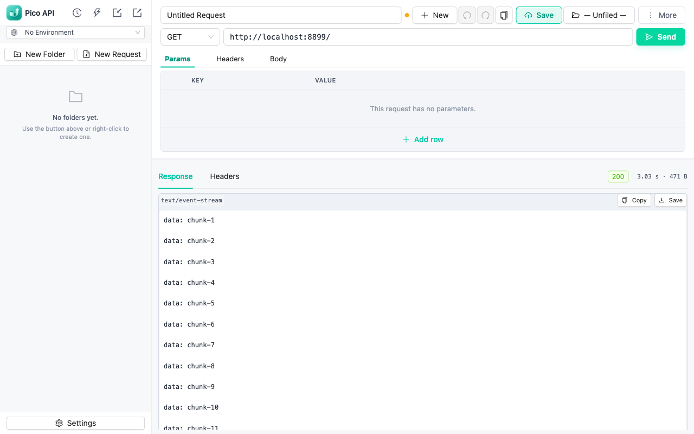

**English** | [简体中文](./README.zh-CN.md)

# Pico API

A lightweight HTTP client and REST API testing tool for Chrome. Send requests,
debug APIs, and watch streaming responses live — without leaving your browser
or creating an account.

<!-- Replace with the real Chrome Web Store badge/link once published:
[](https://chromewebstore.google.com/detail/XXX)
-->



> `pico-` is the SI prefix for 10⁻¹² — the smallest meaningful unit.
> We aim to be the smallest REST client that still feels useful.

## Why Pico API

- **Zero setup** — runs inside Chrome as a tab, no account, no workspace, no cloud sync
- **Local-first & private** — everything stays in your browser's IndexedDB; no analytics, no ads, no third-party scripts ([privacy policy](https://fengliii123.github.io/pico-api/privacy.html))
- **Small on purpose** — the request/response workflow you actually use daily, without the platform weight

## Features

- HTTP request builder: method, URL, params, headers, auth (Bearer / Basic / API key), body (urlencoded / raw JSON / XML / text / form-data)
- **Live streaming responses** — SSE and chunked responses render chunk by chunk as they arrive
- Response viewer with Content-Type-aware rendering (JSON tree, formatted body, headers, cookies, timing)
- Environments & global variables with `{{variable}}` substitution across URL, headers, body, and scripts
- Pre-request & post-response scripts with a Postman-style `pm` API (sandboxed iframe), including `pm.test` assertions
- Collections: tree-structured folders (up to 5 levels), duplicate, move, undo/redo
- History of sent requests (capped) with resend
- Import cURL commands, OpenAPI/Swagger specs, and ApiFox projects; export collections; copy any request as cURL
- Browser cookie forwarding + CORS bypass via the extension service worker
- Command palette (⌘K) and keyboard shortcuts for send / save / switch request / switch environment
- English & 简体中文 UI

## Install

**From the Chrome Web Store** (recommended):

<!-- Replace with the real listing URL once published. -->
Search for "Pico API" in the [Chrome Web Store](https://chromewebstore.google.com).

**From source**:

1. `npm run build`
2. Open `chrome://extensions/`
3. Enable "Developer mode"
4. "Load unpacked" → select `dist/`

## Brand

- **Name**: Pico API (short: **Pico**)
- **Pronunciation**: "PEE-co" (rhymes with "echo", not "pick-o")
- **Tagline**: "Smallest meaningful unit of a REST client"
- **Palette anchor**: cyan/teal (`#00C9A7`) — chosen for fast/clean feel.

## Tech stack

- Vue 3 + TypeScript + Vite
- Pinia for state
- Ant Design Vue for UI components
- Native IndexedDB for persistence
- **No `vuedraggable`** — KeyValueTable uses native HTML5 drag-and-drop
  (the vuedraggable ecosystem is stuck on Vue 2 / Sortable.js shims).

## Development

```bash
npm install
npm run dev      # local dev (loads into a normal browser tab)
npm run build    # production build into dist/
npm test         # unit tests (vitest)
```

After `npm run dev`, open one of these URLs in your browser. The project
root has no `index.html` — visiting `http://localhost:5173/` returns 404,
you have to navigate to a specific entry:

- Main UI:     <http://localhost:5173/src/options/index.html>
- Sandbox:     <http://localhost:5173/src/sandbox/index.html>

## Layout

```
src/
├── background/      service worker (request bridge, streaming, cookie injection)
├── options/         main UI (Vue app)
├── sandbox/         script sandbox (iframe running user scripts)
├── components/
│   ├── layout/      AppLayout
│   ├── tree/        CollectionTree + treeUtils
│   ├── request/     RequestEditor + KeyValueTable + BodyEditor + MethodDropdown
│   ├── response/    ResponsePanel + ResponseBodyRenderer
│   └── common/      StatusTag, EmptyState, CommandPalette, HistoryPanel, SettingsModal…
├── stores/          Pinia: collection, request, response, settings, environment, undoRedo
├── db/              IndexedDB schema + CRUD
├── core/            pure functions: http, headers, url, body, curl, openapi, scripts…
└── utils/           id, format
```

## License

The source code is published for reading and review. It is **proprietary**
and licensed under the terms of [`LICENSE`](./LICENSE) — copying,
redistributing, or re-publishing it (open-source or commercial) requires
written permission from the maintainer.

End users may install and use the compiled extension via the Chrome Web Store.
